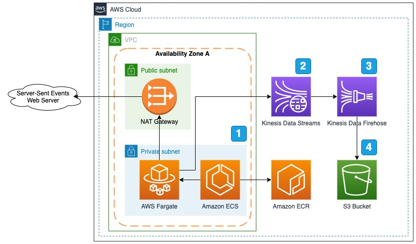

# Ingest Server-Sent Events (SSE) using AWS Fargate

When dealing with real-time data it is often required to send that data over the internet to various sources. Various technologies have enabled this such as web sockets and long polling. Recently server-sent events (SSE) has become a popular technology to push updates to clients. Ingesting this type of data source into AWS requires a client to be running continuously to receive those events. This sample shows how to connect to an SSE endpoint using <a href="https://aws.amazon.com/fargate/">AWS Fargate</a>. This sample creates a docker image with a simple SSE client which publishes to an <a href="https://aws.amazon.com/kinesis/data-streams/">Amazon Kinesis Data Streams</a> stream, then we simply store the event data in <a href="https://aws.amazon.com/s3/">Amazon S3</a>.

## Architecture

1. <a href="https://aws.amazon.com/ecs/">Amazon Elastic Container Service</a> creates <a href="https://aws.amazon.com/fargate/">AWS Fargate</a> instances based on a docker image stored in <a href="https://aws.amazon.com/ecr/">Amazon Elastic Container Registry</a>. The instance created then connects to the SSE endpoint to start receiving events.
1. Each event that is ingested is published to the <a href="https://aws.amazon.com/kinesis/data-streams/">Amazon Kinesis Data Streams</a> stream.
1. The <a href="https://aws.amazon.com/kinesis/data-firehose">Amazon Kinesis Data Firehose</a> receives the event payload from the data stream and sends to the file store.
1. The <a href="https://aws.amazon.com/s3/">Amazon Simple Storage Service</a> bucket is used to store the events for future analysis

## Example SSE use cases:
1. https://developers.facebook.com/docs/graph-api/server-sent-events/
    1. Facebook uses SSE to send out updates for live video comments and reactions
2. https://wikitech.wikimedia.org/wiki/Event_Platform/EventStreams
    1. Wikimedia uses SSE to send all changes to wiki sites
3. https://iexcloud.io/docs/api/#sse-streaming
    1. IEX uses SSE to stream realtime stock quotes
4. https://www.mbta.com/developers/v3-api/streaming
    1. MBTA uses SSE to stream realtime transportation predictions

## Requirements To Compile
1. Apache Maven 3.5 or greater installed
2. Java 11 or greater installed
3. <a href="https://aws.amazon.com/cdk/">AWS Cloud Development Kit</a> (CDK) 1.120.0 or higher

## Compiling
1. Git clone this repository
2. Run the maven package command "mvn package". This will compile the SSE client application that will be used in the docker image by AWS Fargate.

## Setup
1. Create and S3 folder to store the SSE data
2. Navigate to the <b>cdk</b> folder
3. Run the following command to deploy the stack and connect to the sample wikimedia events stream
    1. cdk deploy --parameters S3StorageBucket={YOUR BUCKET NAME HERE} --parameters URL=https://stream.wikimedia.org/v2/stream/recentchange
4. Once the application is running, navigate to the S3 bucket supplied in the CloudFormation properties and view the event data records

## Parameter Options
1. To connect to a different endpoint you can deploy the application with different <b>--parameters</b>. The following parameters are available:
    1. <b>URL</b> (required) - The SSE endpoint to connect
    2. <b>S3StorageBucket</b> - (required) The S3 bucket name used to store the server-sent events data
    3. <b>S3StorageBucketPrefix</b> - (Default sse-data) The prefix used when storing server-sent events data into the S3 bucket
    4. <b>S3StorageBucketErrorPrefix</b> - (Default sse-error) The prefix used when storing error events into the S3 bucket
    5. <b>Headers</b> - (Default none) Headers to send to the SSE endpoint in the form of header1,value1,header2,value2
    6. <b>CollectTypes</b> - (Default all) A comma seperated list of types of SSE events to publish to the Kinesis Data Streams stream
    7. <b>ReadTimeout</b> - (Default 0) The read timeout value in milliseconds to use. It is highly recommended to keep this to the default of 0. The system may not function with a timeout set.
    8. <b>ReportMS</b> - (Default 30000) Log how many messages have been received every X milliseconds, 0 to disable
    9. <b>CPUCapacity</b> - (Default 512) The CPU capacity 256 (.25 vCPU), 512 (.5 vCPU), 1024 (1 vCPU), 2048 (2 vCPU), 4096 (4 vCPU)
    10. <b>MemoryLimit</b> - (Default 1024) The amount (in MiB) of memory used by the task. 512 (0.5 GB), 1024 (1 GB), 2048 (2 GB), Between 1024 (1 GB) and 30720 (30 GB) in increments of 1024 (1 GB)

## Resource Cleanup
### CloudFormation
1. From the <b>cdk</b> folder run <b>cdk destroy</b>

## Security

See [CONTRIBUTING](CONTRIBUTING.md#security-issue-notifications) for more information.

## License

This library is licensed under the MIT-0 License. See the LICENSE file.